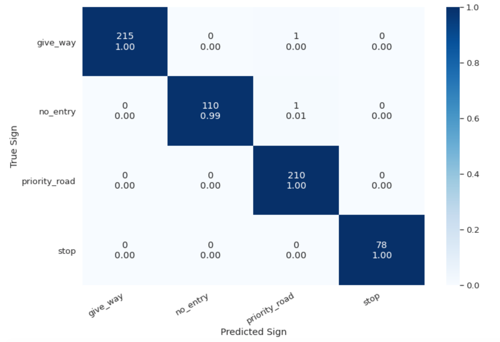
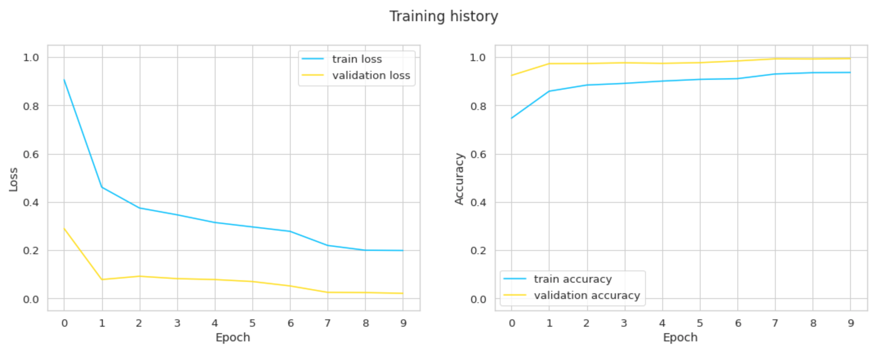

# Transfer Learning for Image Classification with ResNet34

<b>Goal:</b> Classify traffic signs

1) Build the dataset
2) Use transfer learning from a Torchvision model (ResNet34)
3) Fine-tune the pre-trained model

Dataset: http://benchmark.ini.rub.de/?section=gtsrb&subsection=dataset
This dataset contains more than 50,000 annotated images of 40+ traffic signs.

## ResNet34

I tried training the classifier with 4 classes out of the 43 traffic signs. Then I trained it on ALL 43 classes and compared it. Both classifiers did a very good job at learning the classes. Here are the reults for the one with 4 classes:

## Results for classifier with 4 classes

and the one with ALL 43 classes:

## Results for classifier with 43 classes

